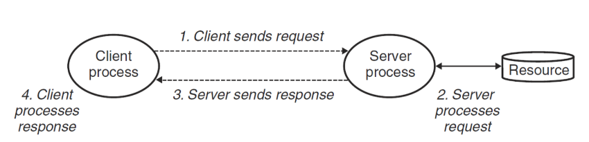
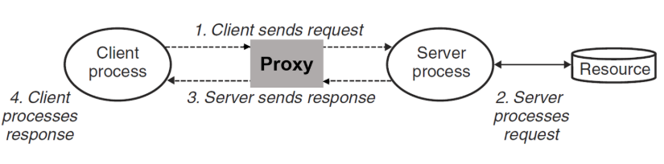
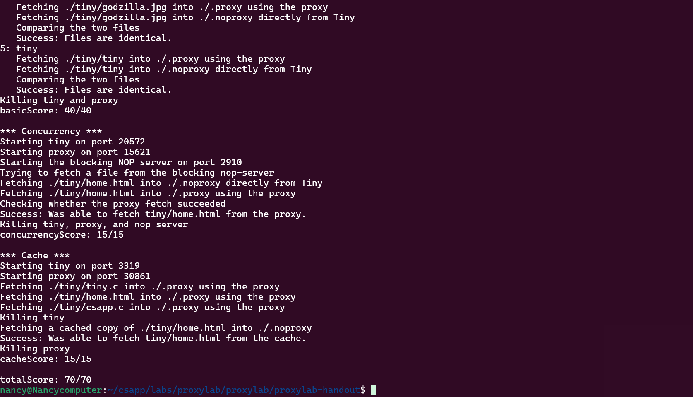

## CSAPP Proxylab 一个多线程带缓存的Web代理

### 项目简介

要求实现一个客户端到服务器之间的中转，即接收客户端的请求后，发生给服务器，然后再把服务器传过来的数据发回客户端

在加代理之前，客户端服务器之间的传输关系如下：



加代理之后，客户端与服务器之间的传输关系如下：



本项目就是要实现一个多线程带缓存的Web代理，实现时分为三个部分来进行：
* 实现一个最基础的顺序代理
* 进一步优化，使代理支持多线程
* 用LRU策略缓存Web中的对象

### 代码思路
首先我们明白，proxy相对于客户端充当的是服务端的角色，而对于服务端则是充当了客户端的角色。

第一部分的代码思路大概就是首先监听并接受来自客户端的请求，按照规定格式做适当的重组之后，发送给服务器，然后再监听并接受来自服务器的数据，传回给客户端。

第二部分就是要我们实现并行，在这里我们选择用线程来实现。当接到客户端发来的连接时，分裂出一个线程去负责该连接，主线程等待下一个连接，在这里我们使用pthread_detach ()，既能使主线程能继续接收下一个连接，子线程在结束之后也能自动回收

第三部分需要为代理加一个缓存，在内存中储存最近使用的Web对象。如果总缓存满了，我们就用LRU策略来淘汰。这里我们为了线程安全，必须采用读者-写者锁。

* 具体代码实现

### 第一部分
我们知道，客户端发送过来的信息格式大概如下GET http://www.cmu.edu:8080/hub/index.html HTTP/1.1，我们应该先从中分离出method uri version，然后进一步从uri中分离出hostname,port,path，并根据此整理好报头，发给服务器，连接到服务器之后，再原封不动把服务器的内容发送过去

首先我们需要链接客户端。我们选择先用一个listenfd作为监听描述符，然后用一个无限循环来接收请求，main函数的初始代码如下：
```c
int main(int argc, char **argv) 
{
    Signal(SIGPIPE, SIG_IGN); //按照题目要求处理SIGPIPE信号
    int listenfd, *client_fd;
    socklen_t clientlen;
    struct sockaddr_storage clientaddr;

    if (argc != 2) {
	fprintf(stderr, "usage: %s <port>\n", argv[0]);
	exit(1);
    }
    listenfd = Open_listenfd(argv[1]);
    while (1) {
	clientlen = sizeof(clientaddr);
    //接受客户端的请求并得到文件描述符
    client_fd = Malloc(sizeof(int));
	*client_fd = Accept(listenfd, (SA *)&clientaddr, &clientlen); 
    doit(client_fd);
    Close(client_fd);
    }
}
```

下面是读取客户端请求，发送给服务器，并把服务器内容传输回客户端的过程
```c
rio_t client_rio;
//先用Rio_readinitb初始化rio缓冲区
Rio_readinitb(&client_rio, client_fd);
if (!Rio_readlineb(&client_rio, buf, MAXLINE)) 
    return;
sscanf(buf, "%s %s %s", method, uri, version);
char uri_copy[MAXLINE];
strcpy(uri_copy, uri);//因为parse_uri里面会更改uri的内容，如果用修改后的uri来存，则永远不会命中了
parse_uri(uri_copy,hostname,port,path);
//构建报头
build_head(http_header,hostname,path,&client_rio);
//链接服务器
server_fd = open_clientfd(hostname,port);
if (server_fd < 0) return;//连接失败
//发送报头到服务器
send_head(server_fd,http_header);
//把server_fd的响应搬运到客户端
while ((n = Rio_readn(server_fd, buf1, MAXLINE)) > 0) { 
    //Rio_readn会阻塞等待服务器的数据，直到读满 MAXLINE 字节或者读到文件末尾（EOF）
    Rio_writen(client_fd, buf1, n);
    if (total_size + n <= MAX_OBJECT_SIZE){
        //用memcpy是因为这个函数是二进制安全的，不会遇到/0就停下来
        memcpy(object_buf + total_size,buf1,n);//追加
        total_size += n;
    } else {
        can_cache = 0;
    }
}
if (can_cache){
    add_to_cache(uri,object_buf,total_size);
}
Close(server_fd);    
```
在这里我们用到了几个自己编写的辅助函数，parse_uri,build_head,send_head

#### 这个函数的功能是从uri中分离出hostname,port,path,存到对应的数组中 
```c
void parse_uri(char *uri, char *hostname, char *port, char *path) {

    strcpy(port, "80"); //端口默认80
    char *ptr = strstr(uri, "//"); //去除协议头
    if (ptr) {
        ptr += 2;
    } else {
        ptr = uri;
    }

    char *p_path = strchr(ptr, '/');
    if (p_path) {
        strcpy(path, p_path);
        *p_path = '\0';//在这里截断，方便获取主机名和端口
    } else { //说明访问根目录
        strcpy(path, "/");
    }

    char *p_port = strchr(ptr, ':');
    if (p_port) {//如果附有端口号
        strcpy(port, p_port + 1);
        *p_port = '\0';
        strcpy(hostname, ptr);
    } else { //没写端口号
        strcpy(hostname, ptr);
    }
}
```
#### 这个函数的作用是根据hostname,path,client_rio构建出需要传输给服务器的报头 
```c
void build_head(char *http_header, char *hostname, char *path, rio_t *client_rio) {
    char buf[MAXLINE];
    char request_hdr[MAXLINE];
    char host_hdr[MAXLINE];
    char other_hdr[MAXBUF] = "";//用来放置浏览器可能传过来的其他报头

    //请求行
    sprintf(request_hdr, "GET %s HTTP/1.0\r\n", path);
    //host
    sprintf(host_hdr, "Host: %s\r\n", hostname);
    //user_agent前面已经给了
    //Connection, Proxy-Connection都是硬编码为close
    //接收浏览器可能发过来的其他报头部分
    while (Rio_readlineb(client_rio, buf, MAXLINE) > 0) { //不停取一行
        if (strcmp(buf, "\r\n") == 0) break; // 遇到空行说明报头结束

        // 过滤掉我们需要手动控制的四个核心报头
        if (strncasecmp(buf, "Host", 4) == 0) continue;
        if (strncasecmp(buf, "User-Agent", 10) == 0) continue;
        if (strncasecmp(buf, "Connection", 10) == 0) continue;
        if (strncasecmp(buf, "Proxy-Connection", 16) == 0) continue;

        // 如果是浏览器发来的其他报头（如 Accept），原样保留
        strcat(other_hdr, buf);
    }
    //把所有部分拼接起来
    sprintf(http_header, "%s%s%s%s%s%s\r\n", 
            request_hdr,
            host_hdr,
            user_agent_hdr,
            "Connection: close\r\n",       // 强制 close
            "Proxy-Connection: close\r\n", // 强制 close
            other_hdr);

}

```
#### 然后是把构建好的报头发送过去的工作
```c
void send_head(int server_fd, char *http_header) {
    Rio_writen(server_fd, http_header, strlen(http_header));
}
```
#### 至此第一部分的基本功能就实现了

### 接下来是第二部分
我们需要实现并行，同时支持多个链接。所以我们需要在接到客户端发送过来的链接时，分裂出一个线程去负责该连接，而主线程则继续等待下一个连接。我们只需要在原本的函数上做一点修改即可。不在main函数中调用doit函数，而是分离出一个线程来调用

先在main函数中调用
```c
Pthread_create(&child_thread,NULL,thread,client_fd);
```

然后设计下面的thread函数，注意该thread函数在开始需要pthread_detach函数，这样线程结束之后才会自动回收
```c
void *thread(void *clientfd_addr) {
    int client_fd = *((int *)clientfd_addr);
    Pthread_detach(pthread_self());//这样子线程运行完会自动回收
    Free(clientfd_addr);
    doit(client_fd);
    Close(client_fd);
    return NULL;
}
```
### 第三部分

我们需要实现缓存，即当客户端请求的内容已经环村路，就不必再链接服务器，可以直接从缓存中获取。由规定的缓存总大小（MAX_CACHE_SIZE 1049000）和单个缓存最大的大小（MAX_OBJECT_SIZE 102400）我们把缓存的
最大个数设为10。

我们在连接弯一个网站之后，先判断其大小是否符合我们缓存的要求，如果符合，我们就把他加到我们的缓存中。
如果新加缓存之后会大于总缓存大小，我们根据LRU（最近最少使用）来进行淘汰。
在读写cache的时候，我们需要考虑加锁，很明显如果两个线程同时在修改cache，便会出现问题。
这里我们考虑采用系统自带的Pthreads读写锁。该读写锁是写倾向的，简单来说就是如果读者来的时候前面没有写者在排队，
并且cache也没有写者在写，那么读者可以直接进入，但是如果有写者在排队，那么读者不能插队，必须排在写者后面。

我们设计以下的结构来放置缓存
```c
typedef struct cacheline{
char cache_uri[MAXLINE];//作为key
char cache_data[MAX_OBJECT_SIZE];//数据部分
int cache_length;//数据大小
int timestamp; //时间戳
int valid;//有效位,0代表未分配
} cacheline;
```

然后是一些操作cacheline的函数

初始化
```c
void init_cache(){
    //初始化
    for (int i = 0; i < CACHE_OBJ_COUNT; i++) {
        cache[i].timestamp = 0;
        cache[i].valid = 0;
    }
    return ;
}
```

根据uri寻找在cache中是否存在缓存内容

```c
int search_data_in_cache(char * uri) {
    for(int i = 0; i < CACHE_OBJ_COUNT; i++){
        if (strcmp(cache[i].cache_uri, uri) == 0 && cache[i].valid == 1) { //为了避免一些错误，我们选择判断valid位
            return i;
        }
    }
    return -1;
}
```

把内容加到cache中

```c
void add_to_cache (char *uri, char* object_buf, int total_size){
    //改前加锁
    pthread_rwlock_wrlock(&cache_lock);
    int index = find_available();
    if (index < 0) {
        index = LRU_strategy();
    }
    strcpy(cache[index].cache_uri,uri);
    memcpy(cache[index].cache_data,object_buf,total_size);
    cache[index].cache_length = total_size;
    cache[index].timestamp = 0;
    cache[index].valid = 1;
    updatetime(index);
    pthread_rwlock_unlock(&cache_lock);
    //改完解锁
}
```
#### 然后是几个辅助函数，
注意我们这里实现lru策略淘汰的方法是给每个cacheline一个时间戳，每当
某一个cacheline被读或者写的时候，我们就更新时间，具体策略就是把该cacheline的时间戳设为0，而把其他
已分配的cacheline的时间戳都+1，这样我们淘汰的时候直接选择时间戳最大的即可。

```c
void updatetime( int index){
    for (int i = 0; i < CACHE_OBJ_COUNT; i++){
        if(cache[i].valid) {
            cache[i].timestamp += 1;
        }
    }
    if (cache[index].valid == 1) {
        cache[index].timestamp = 0;
    }
}

int LRU_strategy(){
    int maxtime = 0;
    int to_eviction = 0;
    for(int i = 0; i < CACHE_OBJ_COUNT; i++){
        if(cache[i].timestamp > maxtime) {
            maxtime = cache[i].timestamp;
            to_eviction = i;
        }
    }
    return to_eviction;
}

int find_available(){
    int index = -1;
    for(int i = 0; i < CACHE_OBJ_COUNT; i++) {
        if (cache[i].valid == 0) {
            index = i;
            return index;
        }
    }
    return index;
}
```

#### 关于读写锁的使用

我们需要在一开始用pthread_rwlock_init来初始化锁，然后任何需要读cache的操作之前调用
pthread_rwlock_rdlock来加读锁，读完之后用pthread_rwlock_unlock来解锁，写操作同理
例如我们在得到一个uri之后，应该先去cache中寻找是否有对应的内容，代码如下所示：

```c
pthread_rwlock_rdlock(&cache_lock);
if ( search_data_in_cache(uri) >= 0) {
    int index = search_data_in_cache(uri);
    Rio_writen(client_fd,cache[index].cache_data,cache[index].cache_length);
    pthread_rwlock_unlock(&cache_lock);//读完解锁
    //更新时间戳
    pthread_rwlock_wrlock(&cache_lock);
    updatetime(index);
    pthread_rwlock_unlock(&cache_lock);
    return;
}
```

#### 至此，我们就已经完成了项目的所有要求，测试结果如下：



但是我们发现任然无法访问百度，因为像百度这样的现代网站，多使用的是CONNECT方法，而我们仅实现了GET方法。于是我们选择在原来的基础上加上CONNECT方法的实现。

实际上CONNECT方法的实现比GET方法更简单直接。因为https的数据是加密的，代理不需要解析命令，只需要作为服务器端和客户端之间的桥梁盲传即可。由于代理端看不见URL等内容，所以也不需要实现缓存。我们在doit函数中添加以下的逻辑：

```c
if (strcasecmp(method, "CONNECT") == 0) {
        char hostname1[MAXLINE], port1[MAXLINE];
        char *p = strchr(uri, ':');
        if (p) {
        *p = '\0';
        strcpy(hostname, uri);
        strcpy(port, p + 1);
    } else {
        strcpy(hostname, uri);
        strcpy(port, "443"); // 默认 HTTPS 端口
    }
    //连接服务器
    server_fd = open_clientfd(hostname, port);
    if (server_fd < 0) return;

    // 3. 告诉浏览器：隧道已建好，你可以发加密数据了
    char *reply = "HTTP/1.1 200 Connection Established\r\n\r\n";
    Rio_writen(client_fd, reply, strlen(reply));

    // 4. 进入“盲传”模式 
    bridge_tunnel(client_fd, server_fd);

    Close(server_fd);
    return;
    }
```

下面是bridge_tunnel函数的实现，该函数的功能就是检测服务器端和客户端，只要任何一端有数据，就立即传给另外一端，直到其中某一端切断联系

```c
void bridge_tunnel(int client_fd, int server_fd) {
    unsigned char buf[MAXLINE];
    fd_set readfds;//想要监控的描述符
    int maxfd = (client_fd > server_fd ? client_fd : server_fd) + 1;

    while (1) {
        FD_ZERO(&readfds);
        FD_SET(client_fd, &readfds);
        FD_SET(server_fd, &readfds);

        // 阻塞等待，直到其中一个 FD 有数据
        //select函数就是会监测所有的描述符
        if (select(maxfd, &readfds, NULL, NULL, NULL) < 0) break;

        // 如果浏览器有数据 -> 发给服务器
        if (FD_ISSET(client_fd, &readfds)) {
            int n = read(client_fd, buf, sizeof(buf));
            if (n <= 0) break; // 连接断开了
            if (write(server_fd, buf, n) != n) break;
        }

        // 如果服务器有数据 -> 发给浏览器
        if (FD_ISSET(server_fd, &readfds)) {
            int n = read(server_fd, buf, sizeof(buf));
            if (n <= 0) break;
            if (write(client_fd, buf, n) != n) break;
        }
    }
}
```
#### 完成之后，我们就能正常访问网站了，一个示例视频如下：
<div align="center">
  <video src="1.mp4" controls width="600px">
    您的浏览器不支持视频播放。
  </video>
</div>
